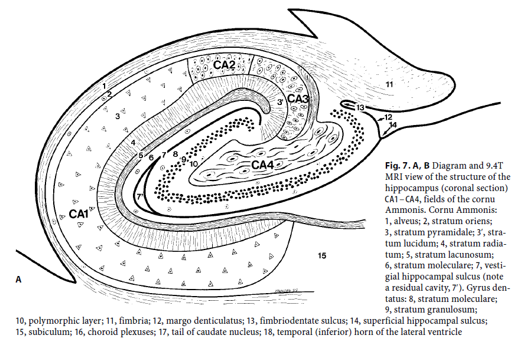
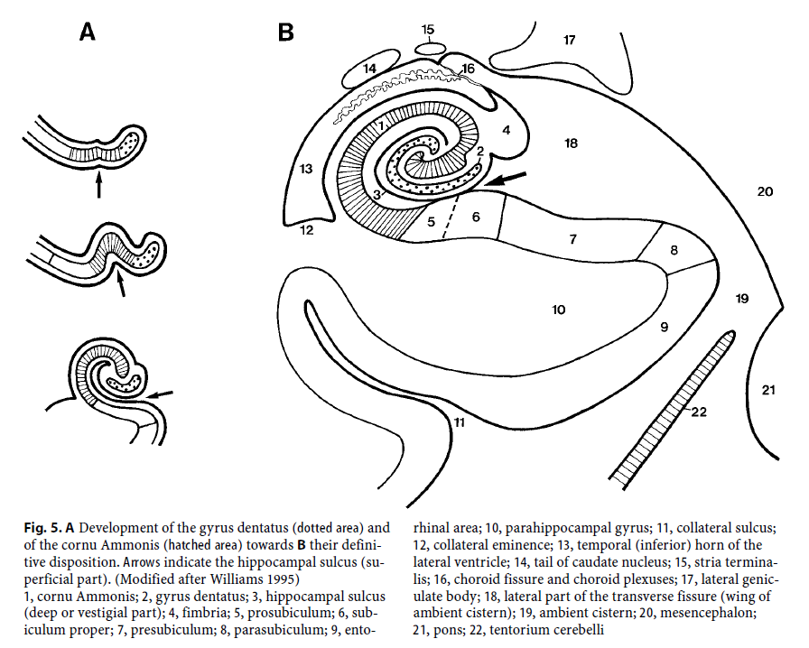
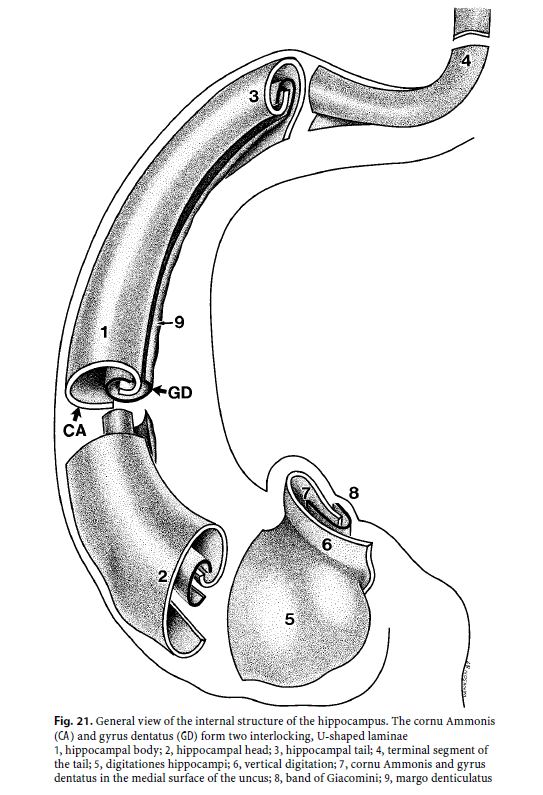
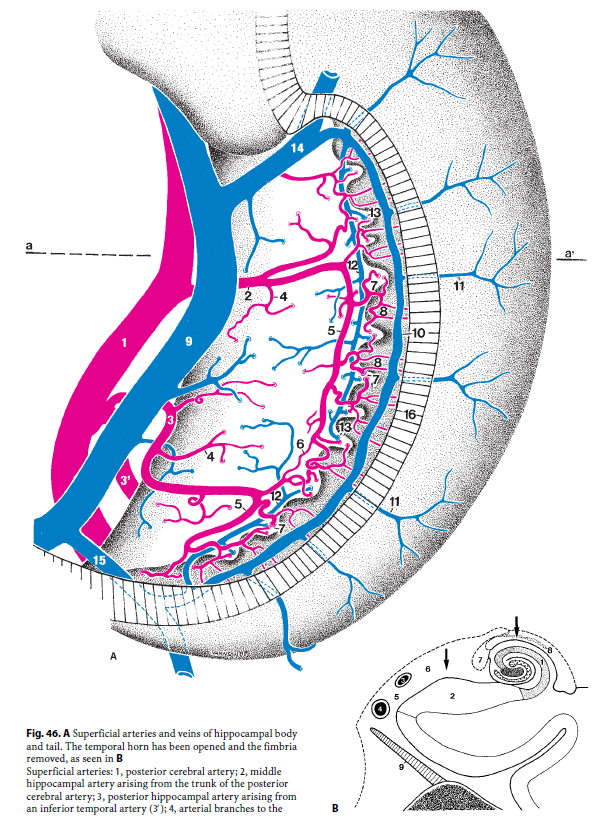
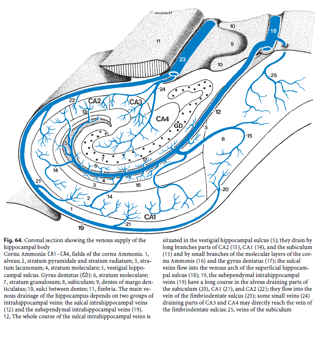
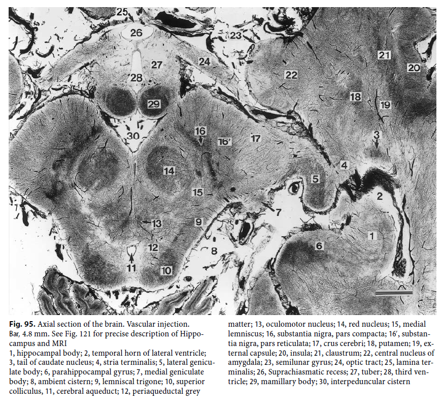
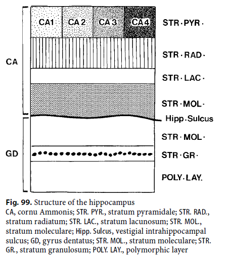
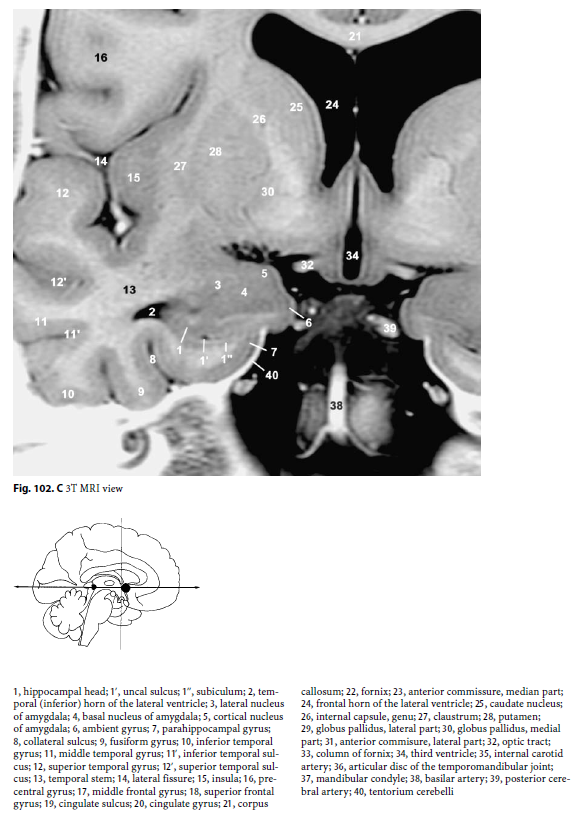
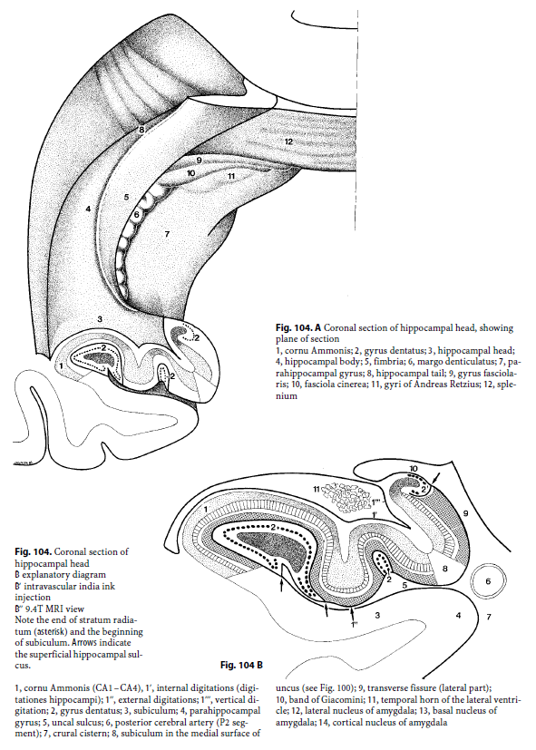

# The Human Hippocampus - Henri Duvernois

## Historical summary

* Arantius (1587) : first mention of this structure $\rightarrow$ gave its name (hesitation with **"silkworm"**)
* J.G. Duvernois (/!\ not Henri) (1729) : first illustration of the structure. (Also hesited with "silkworm")
* Winslow (1732) : hesitated with **"Ram's horn"**

Three different names at the beginning.

Derived into :
* **Cornu Ammonis**
* **Pes hippocampi**

Today considered as synonyms, but **hippocampus** is mainly used.

--------------------------

## Material and methods

60 human brains analysed.

Severall methods used to analyse them.

For the anatomy of the structure :
* dissection
* Bodian's method of silver impregniation

For the vascularization :
* intravascular injection of india ink : view of the arteries and veins. Allows 3 types of observation (obs of the superficial vessels, identification of deep path of intrahippocampal arteries and veins, thick sections).
*intravascular injection with low-viscosity resin : 

---------------------------

## Structure, function and connections

### Structure 
Bilaminar structure (meaning : 2 layers), cornu ammonis (hippocampus proper), gyrus dentatus (fascia dentata). One lamina rolled up inside the other.
Scientists searching for an explanation of this particularity (the 2 layers arn't rolled up during childhood).

Hippocampus divided into :
* deep parts (progressively dissapear)
* superficial parts 

Cornu ammonis and gyrus dentatus are regrouped in the allocortex.

#### Cornu ammonis (CA)
Divided into 6 layers : 
* the alveus, 
* stratum oriens : poorly defined,
* stratum pyramidale : contains the main elements,
* stratum radiatum,
* stratum lacunosum,
* stratum moleculare.

> **Regionnal variations** : 
Heterogeneous shape. 
4 fields (CA1 - CA4).
Other possible divisions (H1 - H5) but very similar.
Different sensitivity to hypoxia (lack of oxygen ; anoxia if severe) into the different parts (CA1 very sensitive, CA3 very resistent, CA4 medium).
Variation of positions between the different species.

#### Gyrus dentatus
A narrow, dorsally concave lamina.

Concave (envelopes CA4).

Separated from the Cornu Ammonis by the hippocampal sulcus. It dissapear during development.

Simpler than the cornu ammonis.

#### Structures joined to the hippocampus

Subiculum : "bed" of the hippocampus.
Linked to CA1 by the prosubiculum.

Severall parts : 
* prosubiculum
* subiculum proper
* presubiculum
* parasubiculum
* enthorinal area

### Functions 

*"Some of the results presented here are controversial and may be subject to discussion"*

#### Learning and memory

Critical role in learning and memory :
"newly acquired items cross the hippocampal filter before being fixed in the isocortex"

* new items (short term memory) : depends on the hippocampus
* old ones (long term memory) : depends on the isocortex

Path of the information : enthorinal area => hippocampus => (stored) association cortex

Implicated in many aspects of the declarative memory :
* **semantic memory** : facts and concepts
* **episodic memory** : recollection of events and relations between them
* **spatial memory** : spatial location and recognition 

Storage of information isn't really understood : maybe permanent changes in biochemical structures of neurons (effected by some neurotransmitters).

##### Hippocampal pathway involved in memory

Intrahippocampal circuitry divided in 2 pathways :
* **polysynaptic pathway** : links all parts of the hippocampus (long neural chain)
* **direct pathway** : directly reaches the output of the hippocampus

##### Clinical implications

Ablation or dammage of the hippocampus =>
* short term memory disorders (amnesia)
* spatial disorders
* some forms of epilespy (controversial)

CA1 : sensitive to anoxia (**maybe** because feeded in blood by big arteries -> very sensitives to blood pressure variations ; **maybe** (more credible) CA3 releases toxic molecules during apoxia killing CA1 cells).
CA2 : controversial/poorly described
CA3 : resistant
CA4 : sensitive (but lesser than CA1)

Apoxia is the main cause of dammages but not the only one (hypoglicemia, ...).

Dammages in CA1 and CA4 are the main elements producing memory issues.

**Aging and Alzheimer** also cause dammages to these regions : mainly to CA1, CA4 but also subiculum (everytime concerning Alzheimer) and sometimes gyratus dentatus.

#### Emmotionnal behavior

Regulation of emotionnal behavior (especially those produced by pain).

#### Motor control

Hypocampus is a part of the ventral striatal loop. 
Involved in motor control (especially drug addiction because it's a part of the dopamine system).

#### Hypothalamus

"The hippocampus is involved in the regulation of the hypothalamo-hypophyseal axis."

"it may inhibit the hypophysial secretion of adrenocorticotrophic hormone (ACTH)"

ACTH : hormone secreted by the hypothyse that induces the creation of cortisol (stress hormone).

-----------------------------------

## Anatomy

Very complex anatomy : can hardly be understood without schemas.

**Two hippocampi** (left and right) : no anatomical differences between the two parts.

Can be divided into 3 parts :
* the head
* the middle part/body
* the tail

Total length of 4/4.5cm.
Wide ~ 1cm (1.5cm for the head)

### Hippocampal body

Two parts :
* intraventricular part (deep)
* extraventricular part (superficial)

### Hippocampal head

Two parts :
* intraventricular part (digitationes hippocampi)
* extraventricular part (uncal part)

### Hippocampal tail 

"As with the body and the head, the tail can be divided into intraventricular and extraventricular parts."

------------------------------

## Vascularization 

### Superficial (Leptomeningeal) Blood Vessels

#### Superficial Hippocampal Arteries

"The hippocampal arteries arise mainly from the
posterior cerebral artery"

Three arteries vascularize the hippocampus :
* **anterior artery** (arise from posterior cerebral artery)
* **middle artery** (arise from posterior cerebral artery)
* **posterior artery** (arises from the splenial artery)

But variations exist (separated in 5 groups : Cf paper p.76).

The hippocampal arteries can be divided into two groups according to their territories:
* the **middle and posterior** hippocampal arteries, supply the hippocampal body and tail
* the **anterior** hippocampal artery vascularizes the hippocampal head and uncus.

#### Superficial Hippocampal Veins
The hippocampal veins are branches of the basal
vein.

### Intrahippocampal (deep) blood vessels

#### Intrahippocampal Arteries

Arteries can be divided into large and small arteries.
Then subdivided into :
* **large ventral** (intrahippocampal arteries) : vascularize CA1 and, by their terminal ramifications, CA2.
* **large dorsal** : penetrate between the dentes of the gyrus dentatus and are then situated inside CA4. Reaches CA3, and sometimes CA2. Vascularize CA4 and the distal part of the gyrus dentatus.
* **small ventral** : vascularize the proximal part of the gyrus dentatus.
* **small dorsal** (a.k.a “straight arteries”) : small intrahippocampal territory limited to CA3 and the adjacent part of CA4.

"The intrahippocampal arteries are **characterized by their curved path** following the rolling up of the cornu Ammonis and the gyrus dentatus."

#### Intrahippocampal Veins

Poorly studied.

Two types of veins :
* **sulcal** veins : course in the vestigial hippocampal sulcus. "Originating from the distal part of CA1 and from the adjacent CA2".
* **subependymal** veins : drain the blood of the deep layers of CA2, CA1, and the adjacent subiculum.

### Hippocampal Head

*"The above description of the intrahippocampal arteries and veins concerns the body and tail of the hippocampus. The hippocampal head is vascularized by arterial and venous axes situated within each digitation (Fig. 68). These vascular axes stem from the superficial network situated in the sulci between the external digitations observed in the uncal sulcus".*

-------------------------------

## Coronal, Sagittal and Axial Sections of the Hippocampus - Showing its Relationships with the Surrounding Structures

----------------------------

## Sectional Anatomy and Magnetic Resonance Imaging

Legend on the following figures :

