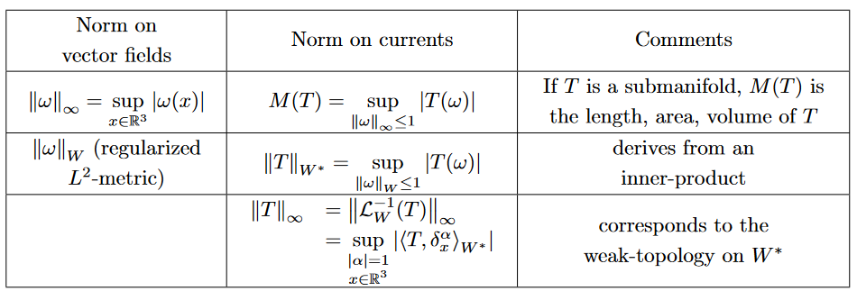
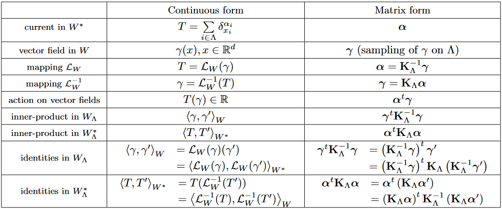

# Statistical models of currents for measuring the variability of anatomical curves, surfaces and their evolutions - Durrleman

## Curves and surfaces embedded in a metric space

> Remark : RKHS = Reproducing Kernel Hilbert Space (functions Hilbert Space where $\forall x$ every application $f\rightarrow f(x)$ is a linear and continious form).

### Introduction and preliminary remarks

Curves and surfaces are generally described as an infinite set of oriented points (the set of all normals to the surface). They are called momenta. The finite approximation of this are meshes.

An other approach is inspired by the flux theory.
Let $\omega$ be a 3D intregable vector field. The flux of $\omega$ through the surface $S$ is defined by :
$S(\omega) = \int_S \omega(x)^t n(x)d\lambda(x)$

« The idea of currents is to characterize a shape by the collection of the real numbers $S(ω)$ for all possible vector fields $ω$.»

### Mathematic formulation 

We need to define "all possible vector fields" $\Rightarrow$ define a proper **test space** $W$.

This space uses Gaussian Kernel :
$K^W(x,y)=e^{\frac{-|x-y|^2}{\lambda_W^2}}I_d$
$\lambda_W$ allows to tune the metric.
And any $\omega\in K$ can be defined as an infinite linear combination of $\omega_{y,\beta}(x) = K^W(x,y)\beta$, we then call $(y,\beta)$ the momentum. 
W is the closed span of the collection $(K^W(x,y)\beta)_{(y,\beta)}$ _(espace vectoriel engendré par la famille ...)_

The collection is then dense in W.

The space of currents, $W^*$ is the space of the continuous linear mapping from W to $\mathbb{R}$.

$\mathcal{L}_W:W\rightarrow W^*$ defined by $\mathcal{L}_W(\omega)(\omega') = \langle \omega, \omega'\rangle_{W}$ $(*)$

$\mathcal{L}_W^{-1}(T)(x) = \sum_k K^W(x,x_k)\alpha_k$

Dirac : $\delta_x^\alpha(\omega)=\langle K^W(x,.)\alpha,\omega\rangle = \alpha^t\omega(x)$

$S(\omega)=\int_S\omega(x)^t n(x) d\lambda(x) \sim \sum_k\omega(x_k)^t n_k$

### Formulation of the distance

$d(T,T') = ||T-T'||_{W^*}= \sqrt{\langle T-T', T-T' \rangle_{W^*}}$

According to equation $(*)$ $||T-T'||_{W^*}^2=(T-T')(\mathcal{L}_W^{-1}(T-T')) = \int_T \Delta(x)^t\tau(x) dx - \int_{T'} \Delta(x)^t\tau'(x)$
where $\Delta(x) = \mathcal{L}_W^{-1}(T-T')$ and $\tau$ (respectively $\tau'$) is the curves of tangents of $T$ (respectively $T'$).

$\Delta(x)$ can be interpreted as the vector field maximising the distance between the two shapes $T$ and $T'$.

### Diffeomorphic deformation of currents 

Simply consist in a change of variable (which can be quite complex if one dives into the details).
_Cf p29 of the paper_

### The space of currents as a RKHS 

> The mass norm previously defined isn't a good way to model shape dissimilarities. 
Discontinuous : if to shapes are the same but one is translated then their distance is constant and become zero only when they match.

New test space that prevents this issue to happen : we want that $\forall\omega, \quad {||\omega||}_{\infty} + {||\Delta \omega||}_{\infty} < \infty$
(Sobolev space)

-----------------------------------------------

### Finite dimensionnal approximation of the RKHS

Discretization of the space of vector fields.
One selects only a few points from the vector fields space denoted $\Lambda = \{x_i^{\Lambda}\}_{i\in \Lambda}$.
Let :
* $\bm{\alpha}$ be the concatenation of the $N$ current vector $(\alpha_i)_{i\in \Lambda}$ of dim $p$ 
* $\bm{\gamma}$ be the concatenation of the $N$ vector field values $(\mathcal{L}_W^{-1}(T)(x_i))_{i \in \Lambda}$

A block matrix is then defined : $K_{\Lambda}$, such that block $(i,j)$ correspond to $K(x_i,x_j)$

That transforms every formula obtained previously into a matrix multiplication formula :
$\bm{\gamma} = K_W \bm{\alpha}$
$\bm{\alpha} = K_W^{-1} \bm{\gamma}$

*p77*
