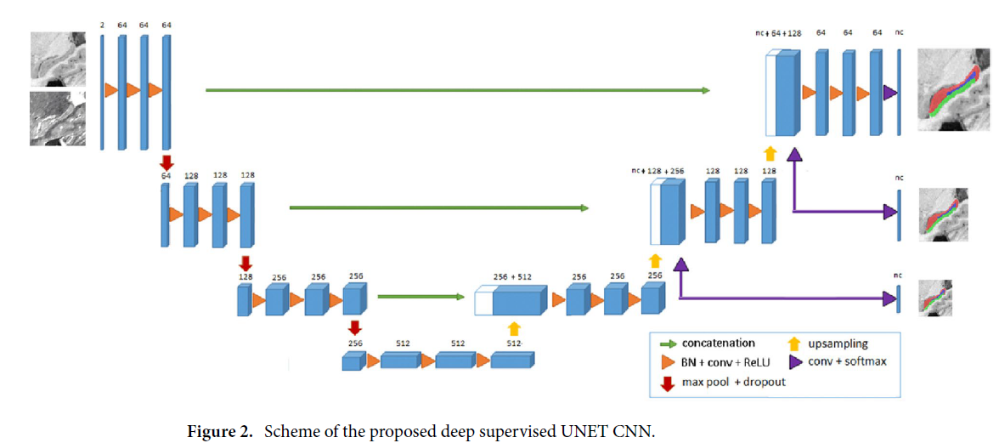

# A novel deep learning based hippocampus subfield segmentation method - Manjon (2022)

Deep learning method using CNN.

## Introduction

This kind of method had already been tested => promising results (compared to state of the art other methods such as ASHS, HIPS).
Issue : need a lot of hand crafted labeled data (time and cost consuming).

In this paper : specific preprocessing to ease the learning with few data.

## Materials and methods 

### Training data 

IRM containing T1w and T2w channels.

2 datasets :
* Kulaga-Yoskovitz dataset : 25 subjects
* Winterburn : 5 subjects

### Image preprocessing 

Different steps :
* 1) Denoising (spatially adaptative non local means filter)
* 2) Intensity inhomogeneity correction
* 3) Affine registration to the MNI space by applying Advanced Normalization Tools (ANTs) packages.
* 4) Cropping to reduce memory and computationnal costs.
* 5) Normalization : $\forall i, x_i \leftarrow \frac{x_i-\mu}{\sigma}$

### Method

#### Architecture 

UNET :
* ( Batch Normalization + Conv +ReLU ) x 3 + Pooling 
* 4 levels of channel size
* Nb of channel : $n_0=64$ and $n_{i+1}=n_i\times 2$
* kernel size (3x3x3)
* dropout (p = 0.5)
* shortcut and concatenation of the downsampling channels.

> Remark : Issues with BN : small dataset => small batches. Resulting in bad normalization during testing during which only one MRI is given (not possible to calculate normalization on batch)

#### Input 
* 3D tensor composed of 2 channels (one channel for a type of MRI)
* data augmentation (cropped images are smoothed and sharpened)

#### Segmentation goal
Multi scale segmenation prediction (Cf right of the schema)

#### Loss

Categorical cross entropy ? Commonly used for classification tasks.

For segmentation Dice Loss (DL) => Generalized Dice Loss (GDL).
$$DL(p,t) = 1 - \frac{2}{NC} \sum_{c=1}^{NC} \frac{\sum_{i=1}^N p_{ci}.t_{ti}}{{\sum_{i=1}^N p_{ci} + t_{ti}}} $$ 

$$GDL(p,t) = 1 - 2 \frac{ \sum_{c=1}^{NC} (w_c.\sum_{i=1}^N p_{ci}.t_{ti})}{{\sum_{c=1}^{NC}(w_c.\sum_{i=1}^N p_{ci} + t_{ti})}} $$

* $p$ : predicted probability
* $t$ : truth probability 
* $N$ : number of voxels
* $NC$ : number of classes
* $w_c = \frac{1}{(\sum_{i=1}^{N}t_{ci})^2}$ : the squared volume.

In this paper : Generalized Jaccard Loss (GJL) 

$$JL(p,t) = 1 - \frac{1}{NC}\frac{\sum_{c=1}^{NC}\sum_{i=1}^{N}p_{ci}.t_{ci}}{\sum_{c=1}^{NC}(\sum_{i=1}^{N}p_{ci}+t_{ci} - \sum_{i=1}^{N}p_{ci}.t_{ci})}$$

$$GJL(p,t) = 1 - \frac{\sum_{c=1}^{NC}(w_c.\sum_{i=1}^{N}p_{ci}.t_{ci})}{\sum_{c=1}^{NC}w_c.(\sum_{i=1}^{N}p_{ci}+t_{ci} - \sum_{i=1}^{N}p_{ci}.t_{ci})}$$

* /!\  $w_c = \frac{1}{\sum_{i=1}^{N}t_{ci}}$ : the volume.

## Experiments and results

Use of cross-validation (small datasets)

### Analysis of the proposed method

Performance of deep network can vary because of many parameters.

* Impact of the __loss function__ : 5 loss studied, GJL is the best.
* Impact of the __architecure__ : this architecture is better than standard UNET.
* Impact of the __data augmenation__ : better with it.
* Impact of the __BN__ : better with it.

### Standard resolution vs high resolution

Former data are in lower resolution : using up-sampling resolution techniques.

Results in low resolution are closed to high resolution.

Can efficiently process bad resolution MRI.

### Method comparision 

Compared with HIPS and one other deep learning method for the same task.
Proposed method is better in term of results.
Bonus : not time consuming at all (1s for a new MRI (2 min with preprocessing), 20 min for HIPS).

